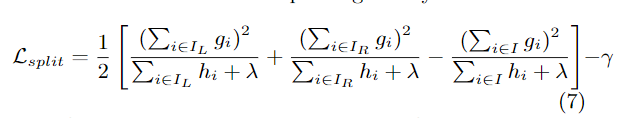

# ResNet

## 介绍

> [Deep Residual Learning for Image Recognition](https://arxiv.org/pdf/1512.03385.pdf)

更深的神经网络更难训练。我们提出了一个剩余学习框架来简化比以前使用的网络更深层次的网络培训。我们参照层输入，明确地将层重构为学习剩余函数，而不是学习未参考的函数。我们提供了综合的经验证据，表明这些剩余网络更容易优化，并且可以从显著增加的深度获得精度。在图像网数据集上，我们评估了深度高达152层\(比VGG网深8倍\)但仍具有较低复杂性的残留网。这些剩余网络的集合在ImageNet test set上实现了3.57 %的误差。这一结果获得了2015年ILSVRC分类任务的第一名。我们还对具有100层和1000层的CIFAR - 10进行了分析。

对于许多视觉识别任务来说，表征的深度至关重要。仅由于我们异常深刻的表示，我们在COCO对象检测数据集上获得了28 %的相对改进。深度残留网是我们提交ILSVRC& COCO 2015年竞赛1的基础，在该竞赛中，我们还赢得了图像网检测、图像网局部化、COCO检测和COCO分割任务的第一名。

## 方法

### 残差模块

我们对每几个堆叠层采用残差学习。构建块如图2所示。在本文中，我们认为构建块定义了一个

$$
\mathbf{y}=\mathcal{F}\left(\mathbf{x},\left\{W_{i}\right\}\right)+\mathbf{x}
$$

### 网络架构

## 性能

